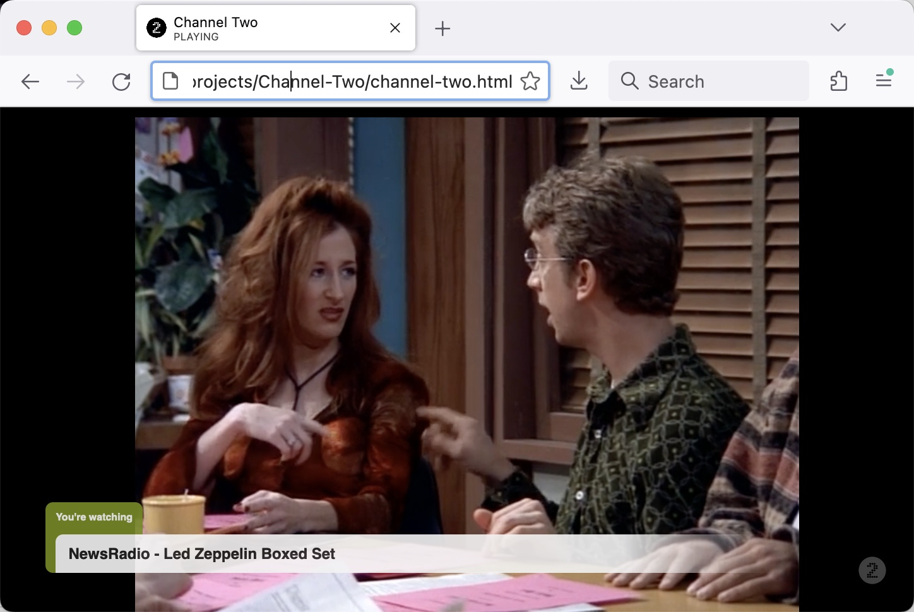
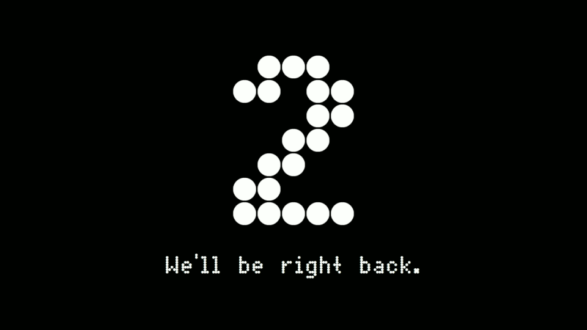
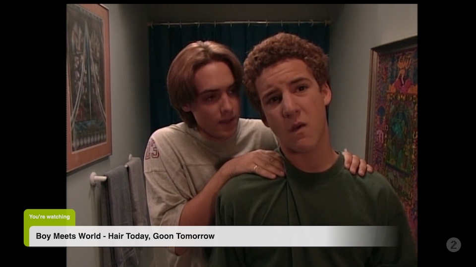

# Channel Two

Channel Two is a JavaScript/HTML5 application for running your own television network in the browser.  It's called Channel Two because I use a [RF modulator](https://www.amazon.com/SatLink-ST-7000-Digital-Modulator-Delivers/dp/B08GYNC666/) to broadcast it on channel 2 in my house.



All you have to do is define the schedule in the [cron-style](https://en.wikipedia.org/wiki/Cron) `schedule.txt` file, run a [PHP script](parse-schedule.php) to process the schedule and generate [some JavaScript](programming.js), and then open the `channel-two.html` in a browser window. It will play your scheduled programming as long as you let it.

## Requirements

You'll need:

* A computer with all of your programming (video files) available to it locally (or a list of all of your video files' URLs, assuming you're OK with the bandwidth required to stream them over the Internet).
* PHP, for generating the schedule file.
* Optionally (but ideally) `ffmpeg` so that Channel Two can cache the video durations.

## How to Schedule Programming

The programming schedule is set in `schedule.txt` via cron-style rules.

You can either schedule specific videos to play at specific times, or you can schedule a folder of videos to be played in a given time slot. For example, if I wanted to play the file `good-morning.mp4` every morning at 7am, I would add this rule to `schedule.txt`:

`0 7 * * * /path/to/good-morning.mp4`

(`/path/to/good-morning.mp4` could also be the URL of a video file.)

And if I wanted to play an episode of Bonanza every day at noon (high noon), I'd add this line:

`0 12 * * * /path/to/Bonanza/`

Every day at noon, Channel Two will play the episode of Bonanza that comes after the last episode of Bonanza that was played (as determined by alphabetical order of the filenames).

"But what if I just want Channel Two to play random videos all day long?"

Sure, do this:

```
* * * * * /path/to/videos/
```

This will continuously loop through the videos in that folder, beginning a new one every time a video ends.

If you'd like to play the videos in random order, add the `shuffle` flag like this:

```
shuffle=true
* * * * * /path/to/videos/
shuffle=false
```

### Programming Blocks

You can also schedule a block of time where videos should be played from a specific folder:

```
* 7-10 * * * /path/to/kids-videos/
```

This would play through all of the files in `kids-videos/` every morning between 7 and 10am. The final video will play until it finishes unless something else is scheduled to play at a specific time that interferes.

### More Examples

You can also schedule programming for specific dates:

```
0 12 25 12 * /path/to/a-christmas-story.mp4
```

This will play "A Christmas Story" at noon on Christmas.

When there is no programming to be played, Channel Two will display `assets/right-back.gif`, which you can of course customize to your liking.



## Commercials!

Like any good network executive, you can also program ads to play around your content.

To turn on commercials for a portion of your schedule, add a line like this:

```
ads=/path/to/Ads/
```

where `/path/to/Ads/` is a folder containing many short video files (in the folder or in subfolders), each ideally under a minute long. Tip: You can find many many many TV commercials on Internet video sites, and tools exist to download them to your own computer.

When ads are enabled, Channel Two will insert ad breaks inside of programming by monitoring when the video fades to black. It will play up to five ads and then resume the show where it left off. If there is time left at the end of the episode before the next half hour, it will play additional ads to fill that time too.

To turn ads back off, add this line:

```
ads=false
```

So in this example, ads will play after `Friends` and `Seinfeld` but not `Sesame Street`.

```
ads=/path/to/Ads/

0 12 * * * /path/to/TV Shows/Friends/
30 12 * * * /path/to/TV Shows/Seinfeld/

ads=false

0 13 * * * /path/to/TV Shows/Sesame Street/
```

### Priority

Subsequent schedule entries take priority over previous entries. So if your schedule looks like this:

```
0 7 * * * /path/to/good-morning.mp4
0 7 15 * * /path/to/special-message.mp4
```

good-morning-household.mp4 will play at 7am, but on the 15th of the month, special-message.mp4 will play instead.

But if your schedule looks like this:

```
0 7 15 * * /path/to/special-message.mp4
0 7 * * * /path/to/good-morning.mp4
```

then `good-morning.mp4` will play every day, even the 15th. It takes priority because it came after the entry for `special-message.mp4`.

*However*, if the cron schedules are exactly the same, the entries are combined into a single schedule. This set of rules:

```
0 7 * * * /path/to/good-morning.mp4
0 7 * * * /path/to/bad-morning.mp4
```

will cause Channel Two to play `good-morning.mp4` the first day at 7am, then `bad-morning.mp4` the second day, then `good-morning.mp4` the third day, etc.

## Closed Captions

If you have WebVTT caption files for your videos, you can force them to be used as closed captions by adding the `captions=true` flag to a scheduling block:

```
captions=true
0 9 * * * /path/to/play-me-with-captions.mp4

captions=false
0 11 * * * /path/to/no-captions-please.mp4
```

Channel Two will looks for a caption file in the same directory that is either the full filename plus ".vtt", or the filename with ".vtt" replacing the original file extension. For the example above, it would look for either `/path/to/play-me-with-captions.mp4.vtt` or `/path/to/play-me-with-captions.vtt`.

While a program is playing, you can press the "c" to force captions to be turned on if they are not already enabled.

Note that because of browser security policies, in order to use caption files, you must be running Channel Two through a Web server as described in the "Caveats" section below.

## Generating the JavaScript programming file

Any time you modify `schedule.txt`, you'll need to re-generate the JavaScript schedule file. Do this:

`$ php parse-schedule.php --schedule schedule.txt`

It will read `schedule.txt` and save the appropriate JavaScript to `programming.js` for Channel Two to function.

You should also re-generate `programming.js` any time you add new files to any directory listed in `schedule.txt`. You could just set up a cron job to run `$ php parse-schedule.php --schedule schedule.txt` every hour; Channel Two will reload `programming.js` regularly in order to refresh the programming schedule.

## Naming Your Files

Channel Two will use the video filenames to display a "You're watching..." chyron at the beginning of any new programming:



It takes the filename, removes the extension, and strips out anything in parentheses. For example, `/path/to/Dallas/A House Divided (Commentary).mp4` would have the chyron "You're watching A House Divided".

## Caveats

Due to browser limitations, you'll have to click the Channel Two "Click to start" image after loading `channel-two.html` in order to allow video playback and fullscreen.


If you want to run Channel Two via a Web server instead of a file:// URL, you'll need to make a few changes:

1. Create a symlink in your Web server's document root to your media folder, using the same name as media folder name. For example, if your video files are stored in /path/to/myvideos/, then you should create a symlink called `myvideos` in your document root:

`$ ln -s /path/to/myvideos /Library/WebServer/Documents/myvideos`

2. Then in `schedule.txt`, make sure that you start all of your video paths with `/myvideos` instead of `/path/to/myvideos`.

3. Add a `base` directive to the top of `schedule.txt` so that the schedule parser knows where to find the files, as the paths in `schedule.txt` will be relative to your Web server root, not necessarily to the directory Channel Two is stored in:

```
base=/Library/WebServer/Documents/
```

I developed this using the latest versions of Firefox and Chrome, so if your copies are at all out of date, I can't guarantee everything works. Have fun, and email me at cfinke@gmail.com with any questions.